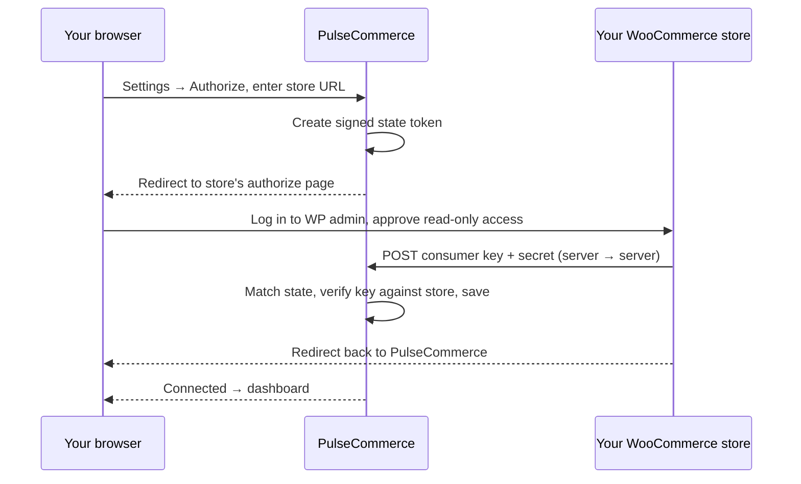

<div align="center">

<picture>
  <source media="(prefers-color-scheme: dark)" srcset="public/logo-dark.svg">
  
</picture>

# PulseCommerce

**Advanced analytics for WooCommerce.**

Customer segmentation, lifetime value, cohort retention, acquisition channels,
campaign performance and board-ready report exports — computed from your live
store, with read-only access you approve yourself.

<p>
  
  
  
  
  
</p>

</div>

---

## What this is

WooCommerce tells you what sold. PulseCommerce tells you **who your best
customers are, which ones are about to leave, where they came from, what they buy
together, and what next month looks like**.

It is a self-hosted Next.js app. You authorize a store through WooCommerce's own
app-authorization endpoint, it pulls your orders over the REST API, caches a
snapshot, and derives every metric from that snapshot at request time.

> **There is no sample data anywhere in this codebase.** Every number you see came
> from your store. A figure can never be a placeholder you mistook for real.

---

## Table of contents

- [Feature list](#feature-list)
- [Feature tour](#feature-tour)
- [Quick start](#quick-start)
- [Connecting a store](#connecting-a-store)
- [Optional password protection](#optional-password-protection)
- [Environment variables](#environment-variables)
- [Reports and exports](#reports-and-exports)
- [How the metrics are defined](#how-the-metrics-are-defined)
- [Architecture](#architecture)
- [Performance](#performance)
- [Design system](#design-system)
- [Deployment](#deployment)
- [Troubleshooting](#troubleshooting)
- [Scripts](#scripts)

---

## Feature list

<details open>
<summary><b>Revenue &amp; performance</b></summary>

- Net revenue, gross revenue, orders, average order value, units sold
- Discounts given, shipping collected, tax collected, refunded amount
- Items per order, revenue per customer, cancellation rate
- Every KPI compared against the **equal-length previous window**
- Revenue and orders on one shared axis (no misleading dual-axis charts)
- Day / week / month bucketing, automatic or manual
- Sparkline trend on each headline stat
- Refund rate, cancellation rate and average fulfilment time
- Generated findings, ranked by urgency, with plain-English explanations

</details>

<details open>
<summary><b>Customer analytics</b></summary>

- **RFM scoring** — recency, frequency and monetary quintiles of your own base
- **Ten standard RFM segments** — Champions, Loyal, Potential Loyalist, New
  Customers, Promising, Need Attention, At Risk, Cannot Lose Them, Hibernating,
  Lost
- **Value tiers** — VIP, High, Mid, Low, One-time
- **Predicted lifetime value** per customer, discounted by churn risk
- **Churn risk score**, judged against each customer's own reorder cadence
- **Revenue deciles** with a Pareto curve and cumulative share
- **Gini concentration coefficient** plus top 1/5/10/20% and bottom 50% shares
- Recency-versus-frequency bubble chart, sized by spend
- Ready-made cohorts: **high value, low value, at risk, rising**
- Full customer ledger: orders, spend, AOV, CLV, recency, cadence, R/F/M,
  top product, refunds, percentile
- Average days between orders, one-time buyer share, repeat rate

</details>

<details open>
<summary><b>Acquisition &amp; retention</b></summary>

- **New vs returning revenue** by month, stacked
- **Full new-customer table** and **full returning-customer table**, sortable and
  searchable, with first-order date, CLV, churn risk and first product bought
- **Acquisition channels** from WooCommerce Order Attribution — organic, direct,
  referral, paid/UTM, admin, mobile app
- Which channels actually bring **first-time** buyers, not just orders
- **Device breakdown** — mobile, desktop, tablet — by revenue and AOV
- Pages per session and revenue per customer, per channel
- **Median time to second order**, with quartiles and a distribution histogram
- **Cohort retention triangle** — monthly acquisition cohorts, retention or
  revenue view, unelapsed cells left blank rather than shown as zero
- **Cumulative LTV curve** per acquired customer
- Attribution coverage percentage, so partial history is never silently hidden

</details>

<details open>
<summary><b>Campaigns &amp; audiences</b></summary>

- **Audience builder** with live reach, revenue represented, predicted CLV and
  average churn risk
- **Goal presets** — VIP appreciation, win-back lapsed, convert to second order,
  rescue at-risk high value, loyal advocates, business accounts — each with a
  stated rationale
- Filter on segment, value tier, recency window, minimum spend, minimum orders,
  churn risk, country, account type, product bought, contactability
- Live audience preview table, exactly matching the export
- **CSV export** shaped for email and ads platforms, with formula-injection
  guarding
- **Campaign performance** from `utm_campaign` — orders, revenue, customers,
  new-customer share, new-customer revenue, AOV, top device
- **Coupon performance** — uses, discount given, revenue, return on discount

</details>

<details open>
<summary><b>Customer profiles</b></summary>

- Click any customer row anywhere in the app to open their profile
- Identity, location, payment method and how long they have been a customer
- **Acquisition channel and device** they arrived on
- RFM scores shown as filled pips as well as numbers, so not colour-only
- Revenue percentile, refunds taken and discounts used
- What they buy, ranked by revenue
- Order value over time
- **Full order history** with status, line items, units, total and net

</details>

<details open>
<summary><b>Inventory &amp; restock planning</b></summary>

- **Days of cover** per SKU from current stock and observed sales velocity
- **Reorder point** from a stated lead time plus safety stock
- **Suggested order quantity** to reach a healthy cover level
- Status per SKU: out of stock, critical, low, healthy, overstocked, untracked
- **Revenue at risk** if a critical SKU stays out for one lead time
- **Capital tied up** per SKU at selling price, to surface overstock
- Restock planner with reorder / all / overstocked views
- **CSV export** shaped as a draft purchase order
- Every assumption stated on the page rather than buried

</details>

<details open>
<summary><b>Product &amp; catalogue analytics</b></summary>

- **ABC classification** — A carries the first 80% of revenue, B the next 15%
- Pareto concentration chart with the 80% threshold marked
- Revenue, units, orders, distinct customers and average price per SKU
- **Stock cover in days** at current velocity, with critical/low flagging
- Units-per-day velocity, refund rate per SKU, average rating
- **Market-basket affinity** — product pairs by support, confidence and lift
- Category revenue and unit mix
- Best sellers by value and by volume; slow movers and never-sold catalogue items

</details>

<details open>
<summary><b>Orders &amp; operations</b></summary>

- Full order register with status, customer, company, units, totals, discount,
  shipping, tax, refunds, payment method and coupons
- New vs returning flag per order
- **Order status mix** and basket-size distribution
- **Payment method** performance by revenue, share and AOV
- **Trading heatmap** — day of week × hour of day
- Weekday revenue performance
- Average fulfilment time, completion share, cancellation and refund rates

</details>

<details open>
<summary><b>Forecasting</b></summary>

- Daily revenue projection from OLS trend × day-of-week seasonality factors
- **95% confidence band** from in-sample residuals
- Implied pace versus the recent actual run rate
- Weekday seasonality shown explicitly, so the sawtooth is explainable
- Forecast horizon and projected total

</details>

<details open>
<summary><b>Geography</b></summary>

- Revenue, orders, customers and AOV by **country**, **region/state** and **city**
- Share of revenue per location

</details>

<details open>
<summary><b>Reports &amp; exports</b></summary>

- **Ten report types** — executive summary, customer ledger, segmentation,
  business accounts, products, categories, order register, cohorts, geography,
  operations, forecast
- **Excel** — one formatted sheet per report, cover page with findings,
  auto-filters, frozen headers, currency number formats
- **PDF** — branded cover with KPI cards and findings, then a table per report
- **CSV** — raw rows, BOM-prefixed, formula-injection guarded
- **Report presets** — board pack, CRM upload, merchandising review, finance
  reconciliation, complete export
- Exports always match the on-screen date range, and are never row-capped
  (except PDF, for readability)
- **Written report view** at `/reports/view` — conclusion first, evidence below,
  method and limits at the end
- One-click export of whatever page you are on

</details>

<details open>
<summary><b>Connection &amp; security</b></summary>

- **WooCommerce app authorization** (`/wc-auth/v1/authorize`) — approve read-only
  access in your own WordPress admin
- **No form or environment variable anywhere accepts a consumer key**
- HMAC-signed, self-contained state token binds the browser redirect to the
  server-to-server callback, with no shared server state, so the two legs may
  land on different serverless instances
- Pluggable durable storage — filesystem when self-hosted, Redis on serverless
- Credentials verified against the store before being persisted
- Issued key stored at `.data/store-config.json` with `0600` permissions,
  gitignored, never sent to the browser
- Preflight rejects non-HTTPS and non-routable callback addresses **before** you
  approve anything
- Optional password login with HMAC-SHA256 signed session cookies, verified in
  middleware via Web Crypto
- One-click disconnect wipes the key and every cached order

</details>

<details open>
<summary><b>Interface</b></summary>

- Light and dark themes, both deliberately designed rather than auto-inverted
- Collapsible sidebar, global date-range picker with presets and custom ranges
- Range and granularity persisted across reloads via an external store
  (no flash of the wrong range on load)
- Sortable, searchable, paginated tables with sticky first column
- Charts: trend, Pareto, ranked bar, donut, heatmap, cohort matrix, scatter,
  forecast band, sparkline
- **CVD-validated eight-slot categorical palette**, checked for colour-vision
  separation, normal-vision distinctness, lightness banding and contrast in both
  modes
- Hover tooltips everywhere; legends whenever two or more series are shown
- Honest empty states that explain *why* a section is empty
- Partial-data and truncated-history warnings surfaced, never hidden
- Geist and Geist Mono, with tabular figures in aligned columns

</details>

---

## Feature tour

### Dashboard
Headline KPIs against the equal-length previous window, a revenue-and-orders trend
on a single shared axis, generated findings ordered by urgency, top products and
customers, payment mix, geography, and a day × hour trading heatmap.

### Customers
Full RFM scoring against quintiles of your own base, mapped to the ten standard
segments. Value tiers, predicted lifetime value, churn risk, and a Pareto view of
revenue deciles with a Gini concentration coefficient. Tabs for **high value, low
value, at risk, rising** and the complete ledger.

### Acquisition
New versus returning revenue by month, with **full sortable tables of new
customers and returning customers**. Channel and device breakdowns from
WooCommerce Order Attribution, which channels actually bring first-time buyers,
and the median time to a second order with a distribution histogram.

### Campaigns
An **audience builder** with goal-driven presets (win-back lapsed, convert to
second order, rescue at-risk high value, VIP appreciation, loyal advocates,
business accounts). Filter on segment, tier, recency, spend, orders, churn risk,
country, account type and product bought; see reach and revenue at stake live;
export a CSV shaped for an email or ads platform. Plus campaign performance from
`utm_campaign` and coupon return-on-discount.

### Customer profiles
Every customer table in the app drills through to a profile: their orders, what
they bought, how they were acquired, their RFM scores and full history.

### Inventory
Days of cover per SKU, reorder points from a stated lead time, suggested order
quantities, revenue at risk from stockouts and capital tied up in overstock,
with a CSV export shaped as a draft purchase order.

### Cohorts and retention
Monthly acquisition cohorts with a full retention triangle and a cumulative LTV
curve. Cells that have not elapsed yet stay blank rather than reading as zero.

### Products
ABC classification (A carries the first 80% of revenue), stock cover in days at
current velocity, refund rate per SKU, category mix, and market-basket affinity
ranked by lift.

### Forecast
Ordinary least squares on the level, multiplied by day-of-week seasonality
factors, with a 95% band from in-sample residuals. Explainable rather than
clever: it answers "are we pacing ahead or behind".

### Orders
Full order register with status mix, basket-size distribution, payment methods,
coupon performance and fulfilment timing.

---

## Quick start

```bash
git clone https://github.com/nitheeshdr/PulseCommerce.git
cd PulseCommerce
npm install
cp .env.example .env.local
npm run dev
```

Open <http://localhost:3000>. The app runs immediately, but every page shows
**"Connect your WooCommerce store"** until one is authorized.

**Requirements:** Node 20+ (developed on 22) and a WooCommerce store with the REST
API enabled. WordPress permalinks must not be set to "Plain", or the REST API
returns 404.

---

## Connecting a store

Connection uses **WooCommerce's own app authorization endpoint**
(`/wc-auth/v1/authorize`). You approve read-only access inside your own WordPress
admin; WooCommerce issues the key and delivers it to this app.

There is deliberately **no form anywhere in this app that accepts a consumer
key**, and no environment variable for one either. A merchant pasting a secret
into a third-party form is exactly the failure mode that endpoint exists to
remove.



### The one requirement

Notice the **server-to-server POST**. WooCommerce delivers the key from *your
store's server* to this app, which means this app must be on a **public HTTPS
address**:

| Requirement | Why |
|---|---|
| HTTPS | WooCommerce refuses to hand credentials to a plain-HTTP callback. |
| Publicly resolvable | `localhost` points your store's server at itself, not at you — however your browser reaches it. |

The app validates both **before** redirecting you, so you can never get stuck
approving an app that could not have received the result.

### Local development

Serve over local HTTPS and expose it through a tunnel:

```bash
npm run dev:https                                   # https://localhost:3000
cloudflared tunnel --url https://localhost:3000     # or: ngrok http https://localhost:3000
```

Put the public address the tunnel prints into `.env.local`, then restart:

```bash
APP_URL=https://your-subdomain.trycloudflare.com
```

Open the app **at that address**, go to **Settings → Authorize your store**, enter
your store URL and approve.

### Production

```bash
APP_URL=https://analytics.yourcompany.com
```

### Disconnecting

**Settings → Disconnect** deletes the stored key and every cached order.

---

## Optional password protection

The app runs open by default, which is what makes "clone and run" work. Set both
variables to require a sign-in:

```bash
AUTH_SECRET=$(openssl rand -hex 32)   # signs the session cookie
APP_PASSWORD=something-long
```

With both set, every analytics route redirects to `/login`. Sessions are
HMAC-SHA256 signed cookies verified in middleware via Web Crypto, so the same code
path runs on Edge and Node.

Completing the WooCommerce authorization also establishes a session — proving you
can approve the store is proof of access. The WooCommerce callback endpoint stays
reachable without a session, because that request is your store calling, not a
browser.

---

## Environment variables

| Variable | Required | Purpose |
|---|:---:|---|
| `APP_URL` | to connect | Public HTTPS address WooCommerce delivers credentials to. Auto-detected on Vercel. |
| `AUTH_SECRET` | **to connect** | Signs the authorization state token and the session cookie. `openssl rand -hex 32`. |
| `APP_PASSWORD` | for login | Set alongside `AUTH_SECRET` to require a password. |
| `KV_REST_API_URL` | on serverless | Redis endpoint for the issued key. Vercel KV and Upstash both provide it. |
| `KV_REST_API_TOKEN` | on serverless | Token for the above. `UPSTASH_REDIS_REST_*` names work too. |
| `SNAPSHOT_CACHE_MINUTES` | no | How long a snapshot stays warm on disk. Default `60`. |

Credentials are **never** environment variables. The issued key is written to
`.data/store-config.json` with `0600` permissions. Both `.data/` and `.env*` are
gitignored, and the secret is never sent to the browser.

---

## Reports and exports

Ten report types — executive summary, customer ledger, segmentation, products,
categories, order register, cohorts, geography, operations and forecast —
downloadable as:

| Format | What you get |
|---|---|
| **Excel** | One formatted sheet per report, cover page with findings, auto-filters, currency number formats, frozen headers. |
| **PDF** | Branded cover with headline KPI cards and findings, then a table per report (capped at 200 rows each for readability). |
| **CSV** | Raw rows for spreadsheets and pipelines, BOM-prefixed, with formula-injection guarding. |

Exports always use the date range currently on screen, so a downloaded report can
never silently disagree with the dashboard it came from. Unlike the on-screen
tables they are **never row-capped**, except in PDF.

`/reports/view` renders the same period as a written document: conclusion first,
evidence below, method and limits at the end.

---

## How the metrics are defined

Being explicit here matters more than being clever, because these definitions are
where analytics tools quietly disagree with each other.

**Net revenue** — order total less tax, shipping and refunds, counted only for
orders in `completed`, `processing` or `on-hold`. Cancelled, failed and pending
orders are excluded from revenue but still counted in cancellation rates.

**Customer identity** — guest checkouts carry no WooCommerce customer ID, so
buyers are keyed on billing email. Someone checking out under two different
addresses appears twice. On a typical store the large majority of orders are
guest checkouts, so this matters.

**Two different repeat rates**, reported separately and deliberately not
conflated:

- *Returning customer rate* — share of customers active in the period who had
  already bought **before** it.
- *Repeat rate in period* — share who bought more than once **inside** it.

On a 30-day window these differ by an order of magnitude. Any tool showing you one
number called "repeat rate" is hiding this from you.

**RFM scores** are quintiles within your own customer base, not absolute
thresholds, so segments stay meaningful whatever your absolute numbers look like.

**Predicted CLV** projects each customer's observed order rate forward twelve
months, discounted by churn risk. It is an estimate, and the UI says so.

**Order Attribution** is core WooCommerce from 8.5. Orders placed before it was
enabled carry none, and the Acquisition page reports the coverage percentage
rather than showing an empty channel list.

**Truncated history** is surfaced as a visible warning rather than silently
skewing every metric.

---

## Architecture

```
src/
├── app/
│   ├── (app)/            Dashboard pages behind the sidebar shell
│   │   ├── dashboard/    Headline KPIs, trend, findings
│   │   ├── customers/    RFM, tiers, CLV, churn, and [key] profiles
│   │   ├── acquisition/  New vs returning, channels, devices
│   │   ├── campaigns/    Audience builder + campaign performance
│   │   ├── cohorts/      Retention triangle, LTV curve
│   │   ├── products/     ABC, stock cover, affinity
│   │   ├── inventory/    Restock planner and reorder points
│   │   ├── orders/       Order register, payments, coupons
│   │   ├── forecast/     Trend + seasonality projection
│   │   ├── reports/      Report builder and written report
│   │   └── settings/     Store authorization and data window
│   ├── api/
│   │   ├── analytics/    Computes the full payload
│   │   ├── auth/woo/     start → callback → return (Woo authorization)
│   │   ├── auth/session/ Password login, sign-out
│   │   ├── reports/      Export generation
│   │   └── settings/     Connection state, data window
│   └── login/
├── lib/
│   ├── woo/              REST client, _fields trimming, entity decoding, attribution
│   ├── store/            Config, snapshot loading, memory + disk cache
│   ├── analytics/        The engine: KPIs, customers, cohorts, products, forecast
│   ├── export/           CSV, Excel and PDF builders
│   ├── auth/             Signed sessions, pending-authorization store
│   └── audience.ts       Campaign audience filtering and CSV shaping
├── components/
│   ├── charts/           Chart primitives on a CVD-validated palette
│   ├── dashboard/        Stat strip, data table, badges, page states
│   ├── layout/           Sidebar, topbar, range picker
│   └── ui/               shadcn/ui
└── middleware.ts         Session gate
```

A snapshot is fetched once and every metric is derived from it at request time.
Nothing is precomputed, warehoused, or sent anywhere else.

---

## Performance

Tested against a live store with **20,468 orders**:

| Concern | Approach |
|---|---|
| Payload size | WooCommerce's `_fields` parameter cuts the orders response from ~900KB to ~160KB per page. Order meta is trimmed to the attribution keys at ingest. |
| Throughput | Orders paginate six connections wide. Customers and products are fetched **first and separately** — running all three concurrently saturated a real store badly enough to time out its customers endpoint. |
| Repeat loads | Memory cache for 10 minutes, disk cache for an hour. Concurrent first-loads collapse into a single upstream fetch. |
| Cold start | ~3 minutes for 20k orders. Every subsequent request is instant. |
| Truncation | A page cap that actually bites raises a visible warning. |

---

## Design system

Chrome is monochrome by intent, so colour is reserved for data series and genuine
state. Charts use an eight-slot categorical palette validated for colour-vision
deficiency separation, a normal-vision distinctness floor, lightness banding and
contrast — in **both** light and dark mode, with dark steps selected for the dark
surface rather than flipped.

Some deliberate choices:

- **No dual-axis charts.** Where two measures share a plot they share one scale,
  and the tooltip reports true values.
- **Sequential ramps are single-hue**, never rainbow. Diverging pairs use a
  neutral midpoint.
- **Legends are always present for two or more series**, so identity is never
  carried by colour alone. Status colours ship with an icon and a written label.
- **Unelapsed cohort cells are blank**, not zero.
- Typography is Geist and Geist Mono, with tabular figures reserved for columns
  that must align.

---

## Deployment

Any Node host works. The app needs a writable `.data/` directory for the issued
key and the snapshot cache.

```bash
npm run build
npm run start
```

Set `APP_URL` to the public HTTPS address, and `AUTH_SECRET` + `APP_PASSWORD` if
you want the dashboard gated.

### Serverless (Vercel, Netlify, Lambda)

These platforms have a **read-only filesystem**, so the issued key cannot be
written next to the app. Provision a Redis store and set:

```bash
KV_REST_API_URL=https://your-store.upstash.io
KV_REST_API_TOKEN=...
AUTH_SECRET=...              # required: signs the authorization state token
```

Vercel KV and Upstash both expose exactly these variables; the
`UPSTASH_REDIS_REST_URL` / `UPSTASH_REDIS_REST_TOKEN` names are also accepted.
`APP_URL` is auto-detected from `VERCEL_PROJECT_PRODUCTION_URL`.

Without a Redis store the app still runs and reports honestly — the connect page
says the deployment cannot save a connection rather than failing mid-flow.

The **snapshot cache** falls back to `/tmp`, which survives between invocations
on a warm instance. Cold starts re-pull from WooCommerce, so for a large store
prefer a host with a persistent volume, or expect the occasional slow first load.

---

## Troubleshooting

**"Your store cannot reach this app"** — `APP_URL` points at localhost or a
private network address. The callback is a server-to-server POST from your store.
Use a tunnel and set `APP_URL` to the public address.

**"WooCommerce never delivered the key"** — the store approved the app but the
callback did not arrive. Check `APP_URL` is reachable from the public internet and
that nothing (WAF, firewall, basic auth) blocks the POST.

**"A valid URL was not provided."** — comes from WooCommerce, not this app. It
means the callback or return URL failed validation, usually because `APP_URL` is
unset or malformed. Set it to a full address including the scheme.

**REST API returns 404** — WordPress permalinks are set to "Plain". Change them in
Settings → Permalinks.

**Customer records unavailable** — the issued key could not read `/customers`.
Analytics fall back to order billing data and the app says so in a warning.

**No attribution data** — WooCommerce below 8.5, or Order Attribution disabled.
It populates for orders placed after you enable it.

---

## Scripts

```bash
npm run dev          # http://localhost:3000
npm run dev:https    # https://localhost:3000, needed for the authorize flow
npm run build        # production build
npm run start        # serve the production build
npm run lint         # eslint
```

---

## Author

**PulseCommerce** is designed and built by **Nitheesh Rajendran** — Founder &
Developer — under **Setups Works**.

[](https://www.linkedin.com/in/nitheeshdr/)
[](https://github.com/nitheeshdr)
[](https://www.imdb.com/name/nm16304237/)
[](https://setups.works)

> Founder of **Setups Works** ([setups.works](https://setups.works)).

> Founder of **CodeForge AI** ([codeforgeai.io](https://codeforgeai.io)).

---

<div align="center">

<br/>

Built with care by

<picture>
  <source media="(prefers-color-scheme: dark)" srcset="public/brand/setups-works-white.png">
  <source media="(prefers-color-scheme: light)" srcset="public/brand/setups-works-black.png">
  
</picture>

<br/>

<sub>Read-only by design · self-hosted · your data never leaves your infrastructure</sub>

<sub>Licensed under the <a href="https://opensource.org/licenses/MIT">MIT License</a></sub>

</div>
