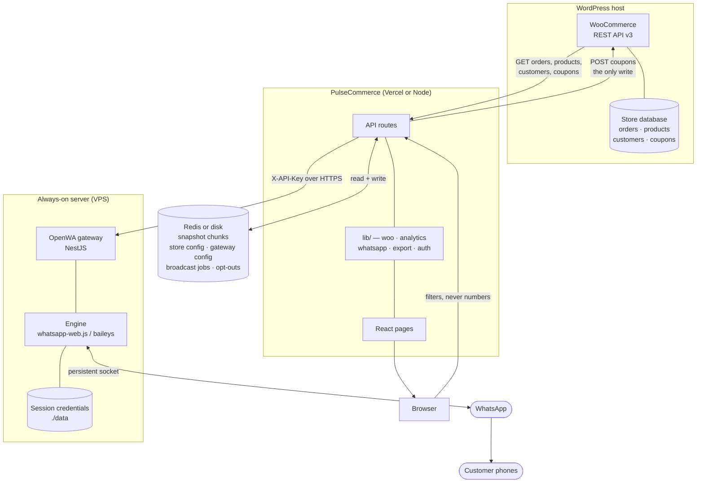
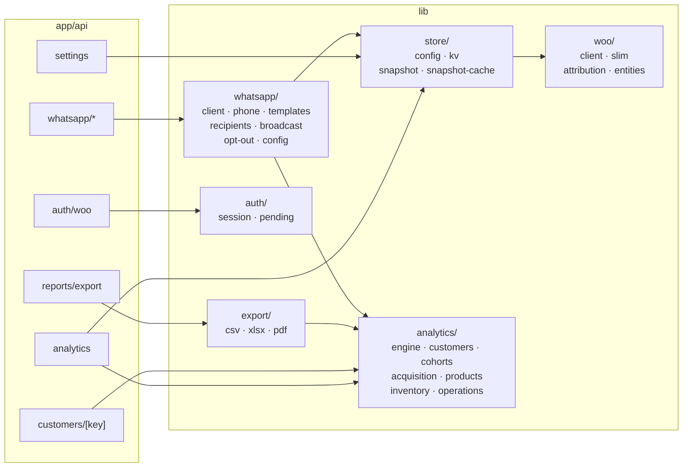
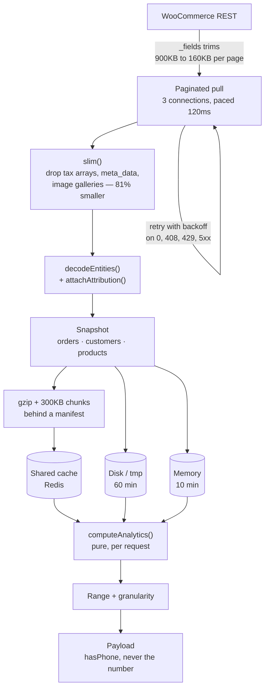
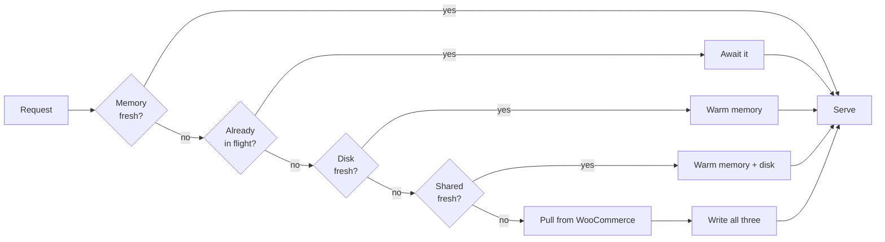
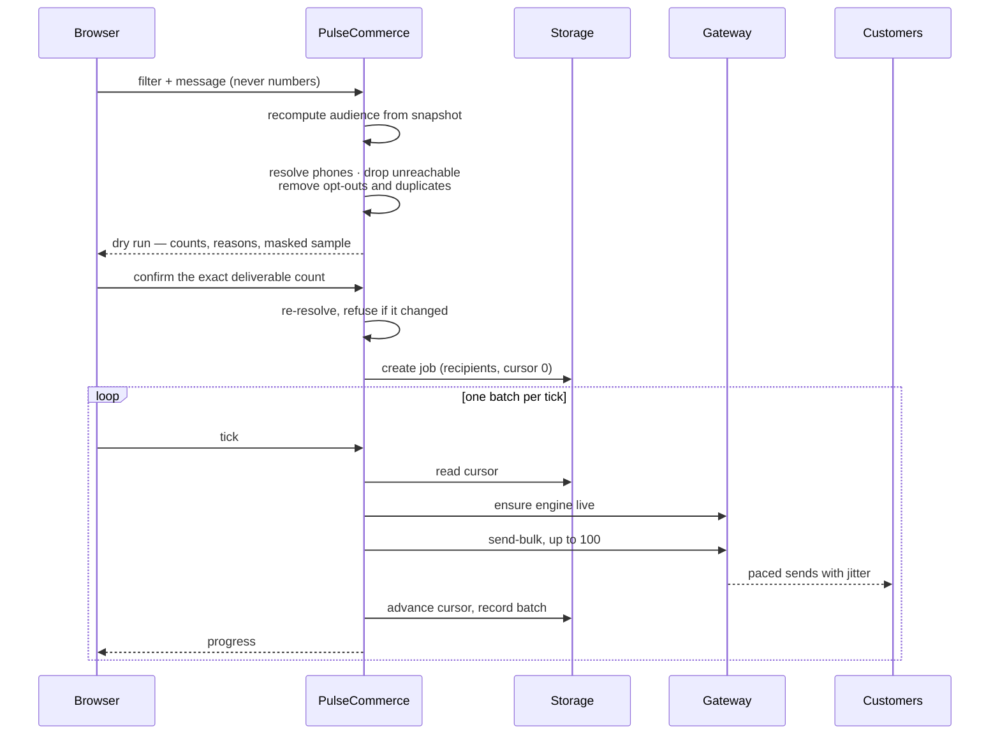
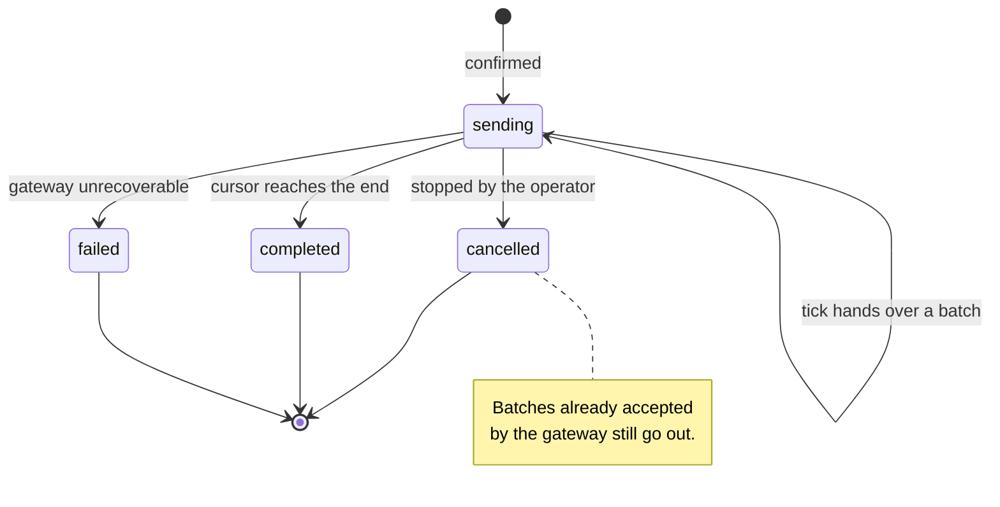
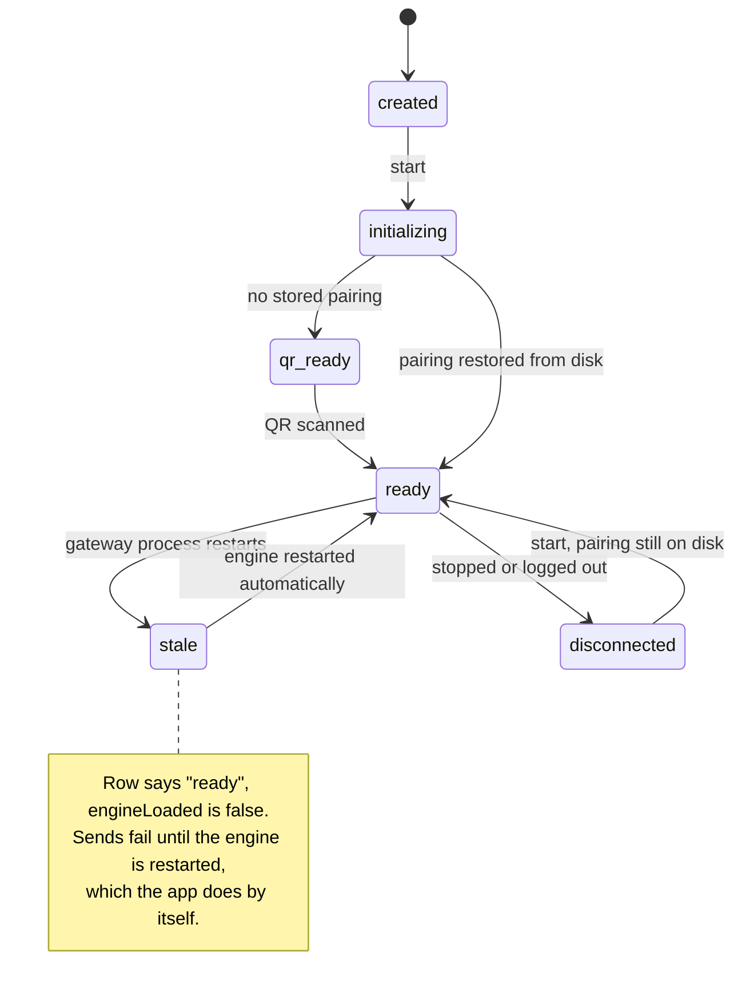
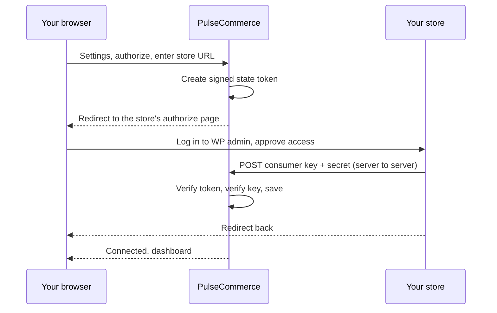

<div align="center">

<picture>
  <source media="(prefers-color-scheme: dark)" srcset="public/logo-dark.svg">
  
</picture>

# PulseCommerce

**Analytics and WhatsApp campaigns for WooCommerce.**

Know who your best customers are, which ones are about to leave, and what they
buy — then message them on WhatsApp from the same screen, through a gateway you
own.

<p>
  
  
  
  
  
</p>

</div>

---

## What this is

WooCommerce tells you what sold. PulseCommerce tells you **who bought it, which
of them is slipping away, what they buy together, which products are about to
run out, and what next month looks like** — and then lets you act on it.

It is a self-hosted Next.js app. You authorize a store through WooCommerce's own
app-authorization endpoint, it pulls your orders over the REST API, caches a
snapshot, and derives every metric from that snapshot at request time. WhatsApp
sending goes through a gateway on your own infrastructure, so customer numbers
never reach a third-party messaging service.

> **There is no sample data anywhere in this codebase.** Every number you see
> came from your store. A figure can never be a placeholder you mistook for real.

---

## Table of contents

- [Feature list](#feature-list)
- [Complete feature list](#complete-feature-list)
- [Feature tour](#feature-tour)
- [Keyboard shortcuts](#keyboard-shortcuts)
- [Small things](#small-things)
- [Architecture](#architecture)
- [Data pipeline](#data-pipeline)
- [Broadcast pipeline](#broadcast-pipeline)
- [Quick start](#quick-start)
- [Connecting a store](#connecting-a-store)
- [WhatsApp campaigns](#whatsapp-campaigns)
- [Multiple stores](#multiple-stores)
- [Optional password protection](#optional-password-protection)
- [Environment variables](#environment-variables)
- [Reports and exports](#reports-and-exports)
- [How the metrics are defined](#how-the-metrics-are-defined)
- [Performance](#performance)
- [Design system](#design-system)
- [Deployment](#deployment)
- [Troubleshooting](#troubleshooting)
- [Scripts](#scripts)

---

## Feature list

<details open>
<summary><b>Revenue &amp; performance</b></summary>

- Net revenue, gross revenue, orders, average order value, units sold
- Discounts given, shipping collected, tax collected, refunded amount
- Items per order, revenue per customer, cancellation rate
- Every KPI compared against the **equal-length previous window**
- Revenue and orders on one shared axis (no misleading dual-axis charts)
- Day / week / month bucketing, automatic or manual
- Sparkline trend on each headline stat
- Refund rate, cancellation rate and average fulfilment time
- Generated findings, ranked by urgency, in plain English

</details>

<details open>
<summary><b>Customer analytics</b></summary>

- **RFM scoring** — recency, frequency and monetary quintiles of your own base
- **Ten standard RFM segments** — Champions, Loyal, Potential Loyalist, New
  Customers, Promising, Need Attention, At Risk, Cannot Lose Them, Hibernating,
  Lost
- **Value tiers** — VIP, High, Mid, Low, One-time
- **Predicted lifetime value** per customer, discounted by churn risk
- **Churn risk score**, judged against each customer's own reorder cadence
- **Revenue deciles** with a Pareto curve and cumulative share
- **Gini concentration coefficient**, top 1/5/10/20% and bottom 50% shares
- Recency-versus-frequency bubble chart, sized by spend
- **Top customer spotlight** with their orders inline
- Ready-made cohorts: **high value, low value, at risk, rising**
- **Advanced filters** — segment, tier, spend, orders, churn risk, recency,
  country, product bought, contactability
- **Every customer listed**, not a capped slice, rows expand in place
- Average days between orders, one-time buyer share, repeat rate

</details>

<details open>
<summary><b>Customer profiles</b></summary>

- Any customer row anywhere drills through to their profile
- Identity, location, payment method, how long they have been a customer
- **Acquisition channel and device** they arrived on
- RFM scores as filled pips as well as numbers, so never colour-only
- Revenue percentile, refunds taken, discounts used
- What they buy, ranked by revenue
- Order value over time
- **Full order history** with status, line items, units, total and net

</details>

<details open>
<summary><b>Acquisition &amp; retention</b></summary>

- **New vs returning revenue** by month, stacked
- **Full new- and returning-customer tables**, sortable and searchable
- **Acquisition channels** from WooCommerce Order Attribution
- Which channels bring **first-time** buyers, not just orders
- **Device breakdown** by revenue and AOV
- Pages per session and revenue per customer, per channel
- **Median time to second order**, with quartiles and a histogram
- **Cohort retention triangle**, unelapsed cells blank rather than zero
- **Cumulative LTV curve** per acquired customer
- Attribution coverage percentage, so partial history is never hidden

</details>

<details open>
<summary><b>Campaigns &amp; audiences</b></summary>

- **Audience builder** with live reach, revenue, predicted CLV and churn risk
- **Goal presets** — VIP appreciation, win-back lapsed, convert to second order,
  rescue at-risk high value, loyal advocates, business accounts
- Filter on segment, tier, recency, spend, orders, churn risk, country, account
  type, product bought, contactability
- Live audience preview, exactly matching the export
- **CSV export** shaped for email and ads platforms, formula-injection guarded
- **Campaign performance** from `utm_campaign`
- **Coupon performance** — uses, discount given, revenue, return on discount

</details>

<details open>
<summary><b>WhatsApp campaigns</b></summary>

- Send **text, image or video** through a **self-hosted gateway** you control
- **Nine templates**: reorder their product, new in a category they buy, win
  back a lapsed customer, nudge a one-time buyer, thank a VIP, ask for a review,
  coupon + their product, coupon only, plain announcement
- **Per-customer variables** — `{{name}}`, `{{product}}`, `{{product_url}}`,
  `{{category}}`, `{{last_order}}`, `{{orders}}`, `{{spend}}`, `{{store}}`,
  `{{coupon}}`, `{{coupon_value}}`
- **Per-customer product photos** — each recipient sees what *they* buy
- **Product picker** — search the catalogue by name, SKU or category and send
  everyone one specific product instead
- **Coupons** — pick an existing WooCommerce coupon, or generate one with an
  expiry, one use per customer, and a restriction to the campaign product
- **Dry run** resolving the real recipient list and sending nothing
- **Test send** to a number you type; it cannot reach a customer
- **Typed confirmation** of the deliverable count before anything goes out
- **Opt-out list**, applied server-side after the audience is built
- **Paced sending** with jitter, as a resumable job with live progress
- **Automatic recovery** when the gateway restarts mid-broadcast
- Link a number by scanning a **QR inside Settings**

</details>

<details open>
<summary><b>WhatsApp inbox</b></summary>

- Conversations with **the customer behind each number**, not raw identifiers
- Orders and lifetime spend beside every conversation
- Link straight through to that customer's full profile
- Thread view that **polls for replies** while open
- Composer for text, media, or a product from your catalogue
- **Start a conversation from a typed number**, without waiting to be messaged
- Unread counts, and search across names and numbers
- Opt-out list applies to one-to-one replies too

</details>

<details open>
<summary><b>Inventory &amp; restock planning</b></summary>

- **Days of cover** per SKU from stock and observed velocity
- **Reorder point** from a stated lead time plus safety stock
- **Suggested order quantity** to reach healthy cover
- Status per SKU: out of stock, critical, low, healthy, overstocked, untracked
- **Revenue at risk** if a critical SKU stays out for one lead time
- **Capital tied up** per SKU, to surface overstock
- Restock planner with reorder / all / overstocked views
- **CSV export** shaped as a draft purchase order

</details>

<details open>
<summary><b>Product &amp; catalogue analytics</b></summary>

- **ABC classification** — A carries the first 80% of revenue, B the next 15%
- Pareto concentration chart with the 80% threshold marked
- Revenue, units, orders, distinct customers, average price per SKU
- Units-per-day velocity, refund rate per SKU, average rating
- **Market-basket affinity** by support, confidence and lift
- Category revenue and unit mix
- Best sellers by value and volume; slow movers and never-sold items

</details>

<details open>
<summary><b>Orders &amp; operations</b></summary>

- Full order register with totals, discount, shipping, tax, refunds, payment
  method and coupons
- New vs returning flag per order
- **Order status mix** and basket-size distribution
- **Payment method** performance by revenue, share and AOV
- **Trading heatmap** — day of week × hour of day
- Weekday revenue performance
- Fulfilment time, completion share, cancellation and refund rates

</details>

<details open>
<summary><b>Forecasting &amp; geography</b></summary>

- Daily revenue projection from OLS trend × day-of-week seasonality
- **95% confidence band** from in-sample residuals
- Implied pace versus the recent actual run rate
- Revenue, orders, customers and AOV by **country**, **region** and **city**

</details>

<details open>
<summary><b>Search &amp; navigation</b></summary>

- **Command palette** over customers, products and orders
- Filtering runs before rendering, so tens of thousands stay fast
- Jump to any page, change the date range, re-sync or switch theme from it
- **Keyboard shortcuts** throughout, with a `?` help sheet
- Shortcuts ignored while typing, so they never eat a search query
- Collapsible sidebar; date range and granularity persisted across reloads

</details>

<details open>
<summary><b>Multiple stores</b></summary>

- Connect **several stores** and switch between them
- Switcher in the sidebar; full management in Settings
- Each keeps its **own credentials, data window and snapshot cache**
- Re-authorizing updates a key in place rather than duplicating the store

</details>

<details open>
<summary><b>Reports &amp; exports</b></summary>

- **Ten report types** — executive summary, customer ledger, segmentation,
  products, categories, order register, cohorts, geography, operations, forecast
- **Excel** — one sheet per report, cover page, auto-filters, frozen headers,
  per-cell currency formats
- **PDF** — branded cover with KPI cards and findings, embedded Unicode font so
  every currency symbol renders
- **CSV** — BOM-prefixed, formula-injection guarded, spreadsheet-parseable
- **Presets** — board pack, CRM upload, merchandising review, finance
  reconciliation, complete export
- Exports match the on-screen date range and are never row-capped
- **Written report view** at `/reports/view` — conclusion first, method last

</details>

<details open>
<summary><b>Connection &amp; security</b></summary>

- **WooCommerce app authorization** — approve access in your own WordPress admin
- **No form or environment variable accepts a WooCommerce consumer key**
- HMAC-signed, self-contained state token binds the browser redirect to the
  server-to-server callback, so the two legs may land on different instances
- Credentials verified against the store before being persisted
- Pluggable durable storage — filesystem self-hosted, Redis on serverless
- Preflight rejects non-HTTPS and non-routable callbacks **before** you approve
- Optional password login, HMAC-SHA256 cookies verified in middleware
- One-click disconnect wipes the key and every cached order
- **Customer phone numbers never reach the browser** — the payload carries only
  whether someone is reachable
- The gateway key is stored the same way and shown only masked

</details>

---

## Complete feature list

Everything in the product, so nothing shipped is undocumented.

<details>
<summary><b>Analytics</b></summary>

**Revenue** — net and gross revenue · orders · average order value · units ·
discounts · shipping · tax · refunds · items per order · revenue per customer ·
cancellation rate · period-on-period comparison · day, week and month views ·
sparkline trends · generated findings ranked by urgency

**Customers** — RFM scoring · ten segments · five value tiers · predicted
lifetime value · churn risk · revenue deciles · Pareto curve · Gini coefficient ·
recency-frequency plot · top-customer spotlight · high value, low value, at risk
and rising cohorts · full ledger with expandable orders

**Profiles** — contact details · location · acquisition channel and device · RFM
pips · revenue percentile · refunds · discounts used · products ranked by revenue
· order value over time · complete order history

**Acquisition** — new versus returning revenue · full customer tables · channel
attribution · first-time buyer analysis per channel · device breakdown · pages
per session · time to second order with quartiles · monthly cohort retention ·
cumulative LTV curve · attribution coverage

**Products** — ABC classification · Pareto concentration · revenue, units, orders
and distinct customers per product · price and velocity · refund rate per product
· average rating · market-basket affinity by lift · category mix · best sellers
by value and volume · slow movers · never-sold items

**Inventory** — days of cover · reorder points from lead time · suggested order
quantities · out of stock, critical, low, healthy and overstocked states · revenue
at risk · capital tied up · restock planner · draft purchase order export

**Operations** — full order register · status mix · basket-size distribution ·
payment method performance · day-by-hour trading heatmap · weekday performance ·
fulfilment timing

**Forecast and geography** — daily revenue projection · 95% confidence band ·
weekday seasonality shown explicitly · revenue, orders, customers and AOV by
country, state and city

</details>

<details>
<summary><b>Messaging</b></summary>

**Campaigns** — audience builder with live reach · six goal presets · filters on
segment, tier, recency, spend, orders, churn risk, country, account type, product
bought and contactability · revenue and predicted value at stake · CSV export for
email and ads platforms · campaign performance from UTM tags · coupon return on
discount

**WhatsApp** — text, image and video · nine templates · eleven personalisation
variables · per-customer product photos · catalogue product picker · coupon
creation and attachment · dry run · test send · typed confirmation · opt-out list
· paced sending with jitter · resumable jobs · automatic gateway recovery · live
progress and stop control

**Inbox** — conversations matched to customers · order count and lifetime spend
beside each · link to full profile · live reply polling · text, media and product
replies · start a conversation from a number · unread counts · search across names
and numbers · opt-out enforced

</details>

<details>
<summary><b>Platform</b></summary>

**Reports** — ten report types · Excel with formatted sheets, filters and currency
formats · PDF with cover, KPIs and findings · CSV for pipelines · board pack, CRM
upload, merchandising and finance presets · written report view · exports match
the on-screen range and are never truncated

**Interface** — multiple stores with instant switching · command palette across
customers, products and orders · keyboard navigation throughout · light and dark
themes · persisted date ranges · sortable, searchable, expandable tables ·
optional password protection · honest empty states · partial-data warnings

**Security** — approval inside your own WordPress admin · no consumer key ever
typed into a form · verification before saving · keys shown masked · phone numbers
never sent to the browser · opt-outs enforced server-side · one-click disconnect
wipes the key and every cached order

</details>

---

## Feature tour

### Dashboard
Headline KPIs against the equal-length previous window, revenue and orders on a
single shared axis, findings ordered by urgency, top products and customers,
payment mix, geography, and a day × hour trading heatmap.

### Customers
RFM scoring mapped to ten segments, value tiers, predicted CLV, churn risk, and
a Pareto view with a Gini coefficient. Top-customer spotlight, advanced filters,
and the complete ledger with orders expandable in place.

### Acquisition and cohorts
New versus returning revenue by month with full tables of each. Channel and
device breakdowns from Order Attribution, median time to a second order, a
retention triangle and a cumulative LTV curve.

### Campaigns
Build an audience, choose a template, attach a coupon and a product, dry-run it,
test it, then send. Plus campaign performance from `utm_campaign` and coupon
return-on-discount.

### Inbox
WhatsApp conversations with the customer behind each number, their order count
and spend alongside, and a composer that sends text, media or a catalogue
product.

### Inventory
Days of cover, reorder points, suggested quantities, revenue at risk and capital
tied up, with a CSV export shaped as a draft purchase order.

### Products, orders and forecast
ABC classification and market-basket affinity; the full order register with
payment and coupon performance; a projection with a 95% band.

---

## Keyboard shortcuts

| Key | Action |
|---|---|
| `⌘K` / `Ctrl K` | Open search and commands |
| `/` | Open search |
| `?` | Show the shortcut list |
| `⌘⇧R` | Re-sync from WooCommerce |
| `⌘⇧L` | Toggle light and dark |
| `g` `d` | Dashboard |
| `g` `f` | Forecast |
| `g` `c` | Customers |
| `g` `a` | Acquisition |
| `g` `h` | Cohorts and retention |
| `g` `p` | Products |
| `g` `i` | Inventory |
| `g` `o` | Orders |
| `g` `m` | Campaigns |
| `g` `w` | Inbox |
| `g` `r` | Reports |
| `g` `s` | Settings |

All shortcuts are ignored while you are typing into a field.

---
## Small things

The details that do not fit a feature list but decide whether the thing is
pleasant to use.

**Interface**

- Date range and granularity persist across reloads, read through an external
  store rather than restored in an effect — so there is no flash of the wrong
  range on first paint
- Tables sort, search, paginate, keep a sticky first column, and expand rows in
  place rather than navigating away
- Tabular figures in every column that has to align; proportional elsewhere
- Empty states explain *why* a section is empty rather than showing zero
- Partial-history and truncated-pull warnings are surfaced, never hidden
- Sidebar collapses; the layout is usable from 375px up
- Light and dark are both designed, not auto-inverted

**Search and keyboard**

- The command palette filters data *before* rendering, so 11,000 customers do
  not mount 11,000 nodes to hide most of them
- Shortcuts are ignored inside inputs, textareas, selects and open comboboxes,
  so typing a search query never triggers navigation
- `g` chords lapse after 1.2 seconds, so a stray `g` does not arm forever
- `?` and `shift+/` both open the help sheet, because keyboard layouts disagree

**Exports**

- CSV is BOM-prefixed so Excel opens UTF-8 correctly
- Formula injection is guarded on text only — an earlier version turned every
  negative number into a string because `-` matched the guard
- Dates export as `yyyy-mm-dd`, parseable by every spreadsheet
- PDFs embed Geist, because the standard PDF encoding has no `₹` glyph and
  silently substituted a superscript one
- Exports follow the on-screen date range, so a download can never disagree with
  the dashboard it came from

**Correctness**

- Cohort cells that have not elapsed are blank, not zero
- New and returning customer lists deliberately overlap; the alternative made
  the returning list empty on any full-history range
- Product names, categories and customer names are HTML-decoded once at ingest,
  so no chart, table, PDF or CSV has to think about it
- Money is formatted from the store's own currency, not a hard-coded symbol

**Safety**

- Secrets are masked everywhere they are displayed and never returned to the
  browser after being saved
- The WhatsApp test send cannot reach a customer — it only accepts a typed number
- Generated coupon codes omit `O`, `0`, `I` and `1`
- Duplicate phone numbers across customer records collapse to one recipient
- Every skipped recipient is counted and categorised, so "sent 9,800 of 11,000"
  always has an explanation

---

## Architecture

Three systems, each on infrastructure you control, and one of them is this app.



Two properties hold by construction rather than by care:

- **The app never speaks to WhatsApp.** It speaks to your gateway, which holds
  the socket. Move the gateway and nothing here changes but a URL.
- **The browser never receives a phone number.** The analytics payload carries a
  `hasPhone` boolean. Numbers are resolved server-side at send time.

### Inside the app



`analytics/` is pure: functions from a snapshot to numbers, with no I/O. That is
what makes a date-range change cost milliseconds and makes every figure
reproducible from the same input.

### Layout

```
src/
├── app/
│   ├── page.tsx              Authorization page (the root)
│   ├── (app)/                Pages behind the sidebar shell
│   │   ├── dashboard/        Headline KPIs, trend, findings
│   │   ├── customers/        RFM, tiers, CLV, churn, [key] profiles
│   │   ├── acquisition/      New vs returning, channels, devices
│   │   ├── cohorts/          Retention triangle, LTV curve
│   │   ├── campaigns/        Audience builder + WhatsApp send panel
│   │   ├── inbox/            WhatsApp conversations
│   │   ├── products/         ABC, refund rate, affinity
│   │   ├── inventory/        Restock planner, reorder points
│   │   ├── orders/           Register, payments, coupons
│   │   ├── forecast/         Trend + seasonality projection
│   │   ├── reports/          Report builder and written report
│   │   └── settings/         Stores, WhatsApp gateway, data window
│   └── api/
│       ├── analytics/        Computes the full payload
│       ├── customers/[key]/  One customer with order history, on demand
│       ├── auth/woo/         start → callback → return
│       ├── reports/          Export generation
│       ├── settings/         Connection state, switching, data window
│       └── whatsapp/
│           ├── settings/     Gateway connection, verified before saving
│           ├── session/      Session state and pairing QR
│           ├── preview/      Dry run — resolves recipients, sends nothing
│           ├── test/         One message to a typed number
│           ├── broadcast/    Create, tick, cancel
│           ├── chats/        Conversations and replies
│           ├── products/     Catalogue search
│           ├── coupons/      List, and the one write in the app
│           └── opt-out/      Numbers excluded from every send
├── lib/
│   ├── woo/                  REST client, field trimming, slimming, attribution
│   ├── store/                Config, KV abstraction, snapshot cache
│   ├── analytics/            Pure engine: KPIs, customers, cohorts, acquisition,
│   │                         products, inventory, operations, forecast
│   ├── whatsapp/             Gateway client, phone normalisation, templates,
│   │                         recipient resolution, broadcast jobs, opt-outs
│   ├── export/               CSV, Excel and PDF builders, embedded fonts
│   └── auth/                 Signed sessions, signed authorization state
├── components/
│   ├── charts/               Chart primitives on a CVD-validated palette
│   ├── dashboard/            Stat strip, data table, filters, page states
│   ├── layout/               Sidebar, topbar, store switcher, command palette
│   ├── whatsapp/             Gateway settings, QR, send panel, product picker
│   └── ui/                   shadcn/ui
└── middleware.ts             Session gate
```

### Scope

The store key is `read_write`, for exactly one reason: creating campaign
coupons. WooCommerce offers no finer scope, so the narrowing is enforced in
code — `WooClient` has one mutating method, `createCoupon`, reached by one
endpoint. Nothing writes to orders, products, customers or settings. Set the
scope back to `read` in `api/auth/woo/start` and re-authorize if you do not want
generated coupons; every other feature is unaffected.

---

## Data pipeline

One pull, cached three ways, then everything derived from it.



### Cache lookup order



**Why a snapshot.** Every metric — RFM, cohorts, affinity, forecast — needs the
whole order history, not a page of it. Computing from one cached snapshot means
a filter change costs milliseconds instead of a re-pull.

**Why in-flight collapsing.** A single page load fires several requests. Without
it, a cold start would begin several identical multi-minute pulls at once.

**Cache key.** Hashed from the schema version, store URL and data window.
Deliberately *not* the consumer key: WooCommerce issues a fresh one on every
re-authorization, and keying on it once orphaned every cached copy at a stroke
and forced a full re-pull that outlived a serverless request.

**Chunks before manifest.** The shared cache writes its chunks first and the
manifest last, so a reader can never find a manifest pointing at chunks that do
not exist yet.

---

## Broadcast pipeline

A broadcast is a resumable job, not a long request.



### Job states



### Gateway session states



**Why ticks.** The gateway paces its own batches — a hundred recipients at four
seconds apart occupies it for roughly seven minutes — which no serverless
request can wait out. Each tick hands over at most one batch and returns, so
closing the page pauses the job rather than breaking it, and whatever was
already handed over still goes out.

**Why recipients are resolved on the server.** The browser sends a *filter*.
Numbers are derived from the snapshot at send time, so no crafted request can
address someone who is not a customer of the connected store, and the opt-out
list cannot be routed around by the UI.

**Why both readiness signals are checked.** `status` is a persisted database
value and `engineLoaded` is the live one. After a gateway restart the row still
says `ready` while the engine is gone, and a send in that state fails for every
recipient. Both must agree before anything is dispatched.

---
## Quick start

```bash
git clone https://github.com/nitheeshdr/PulseCommerce.git
cd PulseCommerce
npm install
cp .env.example .env.local
npm run dev
```

Open <http://localhost:3000>. The app runs immediately, but every page shows
**"Connect your WooCommerce store"** until one is authorized.

**Requirements:** Node 20+ (developed on 22) and a WooCommerce store with the
REST API enabled. WordPress permalinks must not be "Plain", or the REST API
returns 404.

---

## Connecting a store

Connection uses **WooCommerce's own app authorization endpoint**
(`/wc-auth/v1/authorize`). You approve access inside your own WordPress admin;
WooCommerce issues the key and delivers it to this app.

There is deliberately **no form that accepts a consumer key**, and no
environment variable for one. A merchant pasting a secret into a third-party
form is exactly the failure mode that endpoint exists to remove.



### The one requirement

That **server-to-server POST** means this app must be on a **public HTTPS
address**:

| Requirement | Why |
|---|---|
| HTTPS | WooCommerce refuses to hand credentials to a plain-HTTP callback. |
| Publicly resolvable | `localhost` points your store's server at itself, not at you. |

Both are validated **before** you are redirected, so you can never get stuck
approving an app that could not have received the result.

### Local development

```bash
npm run dev:https                                   # https://localhost:3000
cloudflared tunnel --url https://localhost:3000     # or: ngrok http https://localhost:3000
```

Put the public address into `.env.local` as `APP_URL` and restart.

`APP_URL` is auto-detected on Vercel from `VERCEL_PROJECT_PRODUCTION_URL`.

---

## WhatsApp campaigns

Broadcasts go through a **self-hosted [OpenWA](https://github.com/rmyndharis/OpenWA)
gateway** that you run. PulseCommerce is only a client of its REST API.

### What you need

A host that can keep a process running continuously:

| | Works | Why |
|---|:---:|---|
| VPS or cloud server | **Yes** | Docker, persistent volumes, a process that stays up |
| Shared hosting | No | Processes are recycled and the auth directory does not survive |
| Vercel / serverless | No | No long-lived process at all |

A WhatsApp session is a live connection. If the process dies and its data
directory is wiped, the number unlinks and a broadcast that runs for hours never
finishes.

### Setting it up

1. Deploy OpenWA behind HTTPS on your server (Docker Compose is its supported path).
2. Create a session and link a **dedicated number** — see the warning below.
3. Create an API key with the **operator** role. Sending is all this needs.
4. In **Settings → WhatsApp gateway**, enter the URL and key, and confirm the
   country code.

Or set it on the host instead, which survives a redeploy and a cleared store:

```bash
WHATSAPP_API_URL=https://wa.yourdomain.com
WHATSAPP_API_KEY=...            # operator role
WHATSAPP_DIAL_CODE=91           # assumed when a number has no country code
WHATSAPP_SESSION_ID=...         # optional; the only session is adopted if omitted
```

If no number is linked, Settings shows the pairing **QR inline**. It is proxied
through this app, so the gateway key never reaches a browser page.

### Sending

On **Campaigns**, build an audience, then compose below it. The order of the
controls is the safety model:

1. **Check who this would reach** — a dry run. Resolves the real list and sends
   nothing, reporting how many were dropped and why, a masked sample, and the
   message as the first real recipient would see it.
2. **Test** — one message to a number you type. It cannot reach a customer.
3. **Send broadcast** — requires typing the deliverable count. The server
   re-resolves the audience and refuses if it changed.

### Templates and variables

Nine templates, each resolving against the customer's own history. Variables:
`{{name}}`, `{{product}}`, `{{product_url}}`, `{{category}}`, `{{last_order}}`,
`{{orders}}`, `{{spend}}`, `{{store}}`, `{{coupon}}`, `{{coupon_value}}`.

The product chosen is the one they have **spent the most on**, not the most
recent — a one-off small purchase should not become the thing a reorder message
is built around. A variable with no value is removed and the sentence tidied, so
nobody receives a literal `{{product}}` or a dangling comma.

A **campaign product** picked from the catalogue overrides that for everyone,
and supplies the photo.

### Templates

Nine, each written for a specific job rather than as a blank box:

| Template | What it says | When to send it |
|---|---|---|
| Reorder | Names the product they bought, links to it | Their usual reorder gap has passed |
| Category arrivals | New items in the range they already shop | You add stock to a category |
| Win back | References their product and last order date | At Risk or Hibernating segments |
| Second order | Asks how they got on, invites a repeat | One-time buyers, still recent |
| VIP thank you | Names their order count, invites a reply | Champions and top-tier customers |
| Review request | Asks for feedback on what they buy | Repeat customers with a recent order |
| Coupon + product | A discount tied to their own product | Lapsed customers worth converting |
| Coupon only | A store-wide discount offer | Any audience, no clear favourite |
| Announcement | Your own words, greeting still personal | Anything else |

Templates are edited freely before sending. No approval process applies, unlike
Meta's official API.

### Variables

Each resolves per recipient, at the moment of sending:

| Variable | Resolves to |
|---|---|
| `{{name}}` | First name, or nothing for a guest checkout with no usable name |
| `{{product}}` | The product they have **spent the most on** |
| `{{product_url}}` | That product's permalink from WooCommerce |
| `{{product_image}}` | That product's first image |
| `{{category}}` | The category that product belongs to |
| `{{last_order}}` | When they last ordered, e.g. "14 March" |
| `{{orders}}` | How many orders they have placed |
| `{{spend}}` | What they have spent in total, formatted in the store's currency |
| `{{store}}` | Your store name |
| `{{coupon}}` | The coupon code attached to the campaign |
| `{{coupon_value}}` | What it is worth, e.g. "10% off" or "₹150 off" |

**Spent-the-most-on, not most-recent.** A one-off small purchase should not
become the thing a reorder message is built around.

**Unresolved variables collapse.** A variable with no value for someone is
removed and the sentence tidied afterwards — `[^\S\n]{2,}` to a single space,
` ,` to `,`, a line left as a bare colon deleted — so nobody receives a literal
`{{product}}`, a dangling comma, or a label with nothing under it.

### Sending mechanics

| | |
|---|---|
| Spacing | ~4s between messages, plus the gateway's own 0–2s jitter |
| Batch size | 100 recipients per submission (the gateway's maximum) |
| Duration | A full base runs for hours, deliberately |
| Interruption | Closing the page pauses; reopening resumes from the cursor |
| Gateway restart | Detected and recovered automatically, costing one batch of delay |

Every excluded recipient is counted and categorised — no phone on file, an
unreadable number, a duplicate shared with another record, or an opt-out — so
"sent 9,800 of 11,000" always has an explanation.

Pacing is the point. Sending thousands of messages in minutes is the single most
reliable way to have a number restricted.

### Coupons

Pick an existing WooCommerce coupon, or generate one: a code, percentage or
fixed amount, an expiry, one use per customer, and — when a campaign product is
chosen — restricted to that product. Generated codes avoid `O`/`0` and `I`/`1`,
because they get read off a phone screen and typed at a checkout.

Codes that have expired or hit their usage limit are listed but cannot be
selected. Sending a code that will be refused is worse than sending none.

### Phone numbers

Checkout fields are free text, and numbers often carry no country code. The
**default country code** decides what a bare national number becomes, which
makes it the single setting most worth checking — a wrong value sends to the
wrong country.

Anything unreadable as a subscriber number is **dropped and counted**, never
guessed. Duplicates across customer records are collapsed so a household is
messaged once. Numbers never reach the browser.

### Buttons, product cards and link previews

A self-hosted gateway cannot send tappable **buttons** or **product cards**.
Those need pre-approved templates on Meta's Cloud API; WhatsApp withdrew them
from unofficial clients. OpenWA marks its catalog endpoints "not supported by
any engine", and a live gateway answers `501`.

The closest thing is WhatsApp's **link preview**, a tappable card built from the
page itself. Two things affect it:

- **Do not attach a photo** — media suppresses the preview.
- **Your product pages need `og:image`** — most WordPress SEO plugins add it.

> **Use a dedicated number.** OpenWA connects through reverse-engineered clients
> rather than Meta's official API, so there is a real risk of restriction and no
> appeal path. Do not link the number your business runs on. Messaging your own
> past customers is the safest workload; cold-blasting strangers is what gets
> numbers banned.

---

## Multiple stores

Authorize as many as you like. Each keeps its own credentials, data window and
snapshot cache. Switch from the sidebar or Settings; re-authorizing a store you
already have updates its key in place rather than duplicating it. Switching is a
pointer change — the next request reads a different cache rather than re-pulling.

---

## Optional password protection

```bash
AUTH_SECRET=$(openssl rand -hex 32)   # signs the session cookie
APP_PASSWORD=something-long
```

With both set, every route redirects to `/login`. Sessions are HMAC-SHA256
cookies verified in middleware via Web Crypto, so the same code runs on Edge and
Node. Completing the WooCommerce authorization also establishes a session —
proving you can approve the store is proof of access.

---

## Environment variables

| Variable | Required | Purpose |
|---|:---:|---|
| `APP_URL` | to connect | Public HTTPS address WooCommerce delivers credentials to. Auto-detected on Vercel. |
| `AUTH_SECRET` | **to connect** | Signs the authorization state token and session cookie. |
| `APP_PASSWORD` | for login | Set alongside `AUTH_SECRET` to require a password. |
| `KV_REST_API_URL` | on serverless | Redis endpoint. Vercel KV and Upstash both provide it. |
| `KV_REST_API_TOKEN` | on serverless | Token for the above. `UPSTASH_REDIS_REST_*` also accepted. |
| `SNAPSHOT_CACHE_MINUTES` | no | How long a snapshot stays warm. Default `60`. |
| `WHATSAPP_API_URL` | no | Gateway base URL. Takes the connection out of the UI. |
| `WHATSAPP_API_KEY` | no | Gateway API key, operator role. |
| `WHATSAPP_SESSION_ID` | no | Which session to send from. Adopted automatically if omitted. |
| `WHATSAPP_DIAL_CODE` | no | Country code for numbers stored without one, e.g. `91`. |
| `WHATSAPP_SEND_DELAY_MS` | no | Pause between messages. Default `4000`; gateway floor `1000`. |

WooCommerce credentials are **never** environment variables — they arrive only
through the authorization flow.

---

## Reports and exports

Ten report types, as **Excel** (formatted sheets, cover page, auto-filters),
**PDF** (branded cover, embedded font so `₹` renders), or **CSV** (bare numbers,
parseable dates, BOM-prefixed, formula-injection guarded).

Exports use the date range on screen, so a downloaded report can never silently
disagree with the dashboard it came from, and are never row-capped except in PDF,
which prints the columns that fit a page and says so.

---

## How the metrics are defined

**Net revenue** — order total less tax, shipping and refunds, for orders in
`completed`, `processing` or `on-hold`. Cancelled, failed and pending are
excluded from revenue but counted in cancellation rates.

**Customer identity** — guest checkouts carry no customer ID, so buyers are keyed
on billing email. Someone using two addresses appears twice.

**Two different repeat rates**, reported separately: *returning customer rate*
(active in the period, bought before it) and *repeat rate in period* (bought more
than once inside it). On a 30-day window these differ by an order of magnitude.

**New and returning lists overlap by design.** A customer acquired in the period
who buys again is genuinely both.

**RFM scores** are quintiles within your own base, not absolute thresholds.

**Predicted CLV** projects the observed order rate twelve months forward,
discounted by churn risk. It is an estimate, and the UI says so.

**Days of cover** is stock divided by units sold per day over the range.

**Order Attribution** is core WooCommerce from 8.5; earlier orders carry none,
and the coverage percentage is reported rather than hidden.

---

## Performance

Against a production store of roughly **20,000 orders and 11,000 customers**:

| Measure | Result |
|---|---|
| Cold instance, empty memory and disk | 3.5 s |
| Warm request | 0.7 s |
| Deployed production request | ~2 s |
| Full-year customer payload, on the wire | 911 KB |
| Cached snapshot | 2.0 MB gzipped |

**Payload trimming.** `_fields` does not reach nested arrays, so every line item
arrived carrying its tax breakdown, `meta_data` and a full image object.
Removing what the engine never reads cut the payload **81%**.

**Shared caching.** The snapshot is cached where every instance can see it,
gzipped and chunked behind a manifest, chunks written before the manifest so a
reader never sees a partial set. A per-instance cache meant each cold start
re-pulled the whole history — slow, and enough traffic that the store's security
layer began refusing requests.

**Order history on demand.** Customer records ship without their orders, which is
half a record's weight. That is what lets the ledger list every customer.

**Paced fetching.** Orders paginate three connections wide with a pause between
batches. Transient failures retry with exponential backoff.

---

## Design system

Chrome is monochrome by intent, so colour is reserved for data and genuine state.
Charts use an eight-slot categorical palette validated for colour-vision
deficiency separation, a normal-vision distinctness floor, lightness banding and
contrast — in **both** modes, with dark steps selected for the dark surface
rather than flipped.

- **No dual-axis charts.** Two measures sharing a plot share one scale.
- **Sequential ramps are single-hue**; diverging pairs use a neutral midpoint.
- **Legends always present for two or more series**, so identity is never colour
  alone. Status colours ship with an icon and a label.
- **Unelapsed cohort cells are blank**, not zero.
- Geist and Geist Mono, tabular figures in columns that must align.

---

## Deployment

```bash
npm run build
npm run start
```

Set `APP_URL`, plus `AUTH_SECRET` and `APP_PASSWORD` to gate the dashboard.

### Serverless

Read-only filesystem, so provision Redis:

```bash
KV_REST_API_URL=https://your-store.upstash.io
KV_REST_API_TOKEN=...
AUTH_SECRET=...
```

Without it the app still runs and says the deployment cannot save a connection
rather than failing mid-flow. The snapshot cache is shared through the same
Redis, so cold starts read it rather than re-pulling.

**The WhatsApp gateway cannot live here.** It needs a process that stays up.

---

## Troubleshooting

**"Your store cannot reach this app"** — `APP_URL` points at localhost or a
private address. The callback is a server-to-server POST. Use a tunnel.

**"This deployment cannot save a connection"** — serverless with no Redis. Set
`KV_REST_API_URL` and `KV_REST_API_TOKEN`, then redeploy.

**"AUTH_SECRET is not set"** — generate one with `openssl rand -hex 32`.

**"WooCommerce never delivered the key"** — check `APP_URL` is publicly reachable
and nothing (WAF, firewall, basic auth) blocks the POST.

**REST API returns 404** — WordPress permalinks are "Plain".

**"The store key is read-only"** on coupon creation — the key predates the scope
change. Reconnect the store in Settings to re-approve it.

**WhatsApp session keeps dropping / shows `qr_ready`** — the host cannot keep a
process alive or is not persisting the gateway's data directory. Move it to a VPS.

**"The session cannot send right now"** — status and engine disagree, which
happens after a gateway restart. The app restarts the engine automatically; if it
persists, the pairing itself is gone and the QR needs re-scanning.

**Everyone dropped as "unreadable"** — the default country code is empty or wrong.

**No attribution data** — WooCommerce below 8.5, or Order Attribution disabled.

**Inventory page empty** — stock management is not enabled on the products.

---

## Scripts

```bash
npm run dev          # http://localhost:3000
npm run dev:https    # https://localhost:3000, needed for the authorize flow
npm run build        # production build
npm run start        # serve the production build
npm run lint         # eslint
```

---

<div align="center">

<br/>

Built by

<picture>
  <source media="(prefers-color-scheme: dark)" srcset="public/brand/setups-works-white.png">
  <source media="(prefers-color-scheme: light)" srcset="public/brand/setups-works-black.png">
  
</picture>

<br/>

[setups.works](https://setups.works)

<sub>Self-hosted · your data and your WhatsApp number stay on your infrastructure</sub>

<sub>Licensed under the <a href="https://opensource.org/licenses/MIT">MIT License</a></sub>

</div>
